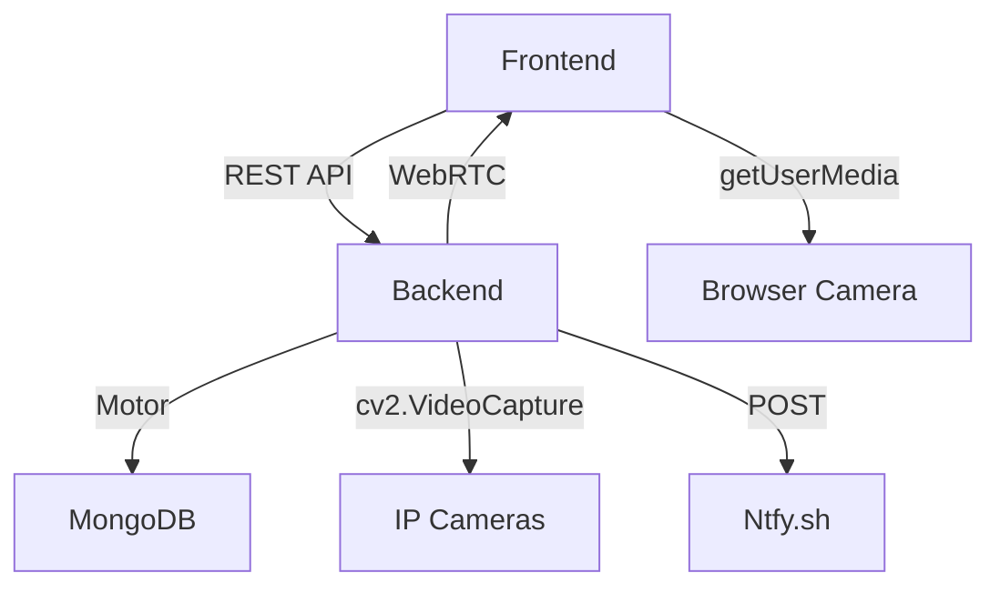

# AI Prompts for Generating Architecture & Data Flow Diagrams in Mermaid

Use these prompts with AI tools (ChatGPT, Claude, etc.) to generate Mermaid diagrams for your Smart Safety CCTV System.

---

## 📐 PROMPT 1: System Architecture Diagram

### **For ChatGPT / Claude / Any LLM**

```
Generate a Mermaid graph diagram for a Smart Safety CCTV monitoring system with the following components:

COMPONENTS:
1. Frontend Layer (React + Vite)
   - Subcomponents: Dashboard, Camera Stream Component, Attendance Scanner, Worker Management

2. Backend Layer (FastAPI + Uvicorn)
   - Subcomponents:
     * WebRTC Signaling Layer (RTCPeerConnection, Offer/Answer)
     * Stream Manager (NetworkCameraTrack threads)
     * AI Services (PPEService, FireService, FallService)
     * REST API Endpoints
     * Alerting System

3. Data Layer
   - MongoDB with collections: cameras, workers, attendance, alerts

4. External Services
   - IP Cameras (RTSP/HTTP streams)
   - Browser Cameras (getUserMedia)
   - Ntfy.sh (Push notifications)

CONNECTIONS:
- Frontend connects to Backend via REST API (/cameras, /workers, /attendance)
- Frontend connects to Backend via WebRTC Signaling (/offer endpoint)
- Backend connects to MongoDB via Motor (async driver)
- Backend connects to external cameras URLs
- Backend sends alerts to Ntfy.sh endpoints
- WebRTC streams video from Backend to Frontend

LAYOUT:
- Top layer: Frontend
- Middle layer: Backend (with sublayers for each service)
- Bottom layer: Data persistence
- Right side: External services

OUTPUT: Provide ONLY the Mermaid graph code (no markdown, no explanations), starting with "graph TD" or "graph LR"
```

---

## 📊 PROMPT 2: Data Flow Diagram (Streaming Flow)

### **For ChatGPT / Claude / Any LLM**

```
Generate a Mermaid diagram showing the complete data flow for real-time camera streaming with AI detection in a Smart Safety CCTV system.

FLOW STEPS:
1. User clicks "Start" on camera card in Frontend
2. Frontend creates RTCPeerConnection and sends WebRTC Offer to /offer endpoint
3. Backend receives offer with camera_url and monitored_ppe
4. Backend creates NetworkCameraTrack and spawns two threads:
   Thread A: _ingest_video() continuously fetches frames from camera URL
   Thread B: _ai_inference_loop() runs YOLO detection on frames
5. Thread A: Reads frames via cv2.VideoCapture → Stores in current_inference_frame → Puts in Queue(maxsize=1)
6. Thread B: Reads current_inference_frame → Runs YOLO PPE/Fire/Fall detection → Stores results
7. Backend sends WebRTC Answer back to Frontend (SDP)
8. WebRTC connection established, recv() called every 33ms
9. recv() gets latest frame from Queue → Draws AI annotations → Returns VideoFrame
10. Frontend receives frames via WebRTC video track
11. Browser renders video in <video> element
12. If alert triggered: Backend sends notification to Ntfy.sh endpoint
13. Frontend receives push notification

ACTORS:
- User/Admin
- Frontend Browser
- Backend API
- Thread A (Ingestion)
- Thread B (AI)
- MongoDB
- Camera URL
- Ntfy.sh
- WebRTC

STYLE:
- Use different colors for different types of processes (ingestion=blue, ai=green, webrtc=purple, alerts=red)
- Show parallel execution of threads
- Show timing (33ms frame rate)

OUTPUT: Provide ONLY the Mermaid sequenceDiagram code, starting with "sequenceDiagram"
```

---

## 🔄 PROMPT 3: Attendance + PPE Verification Flow

### **For ChatGPT / Claude / Any LLM**

```
Generate a Mermaid diagram showing the complete workflow for QR-based attendance with PPE verification.

FLOW STEPS:
1. Admin selects required PPE (e.g., "Hardhat", "Safety Vest")
2. Worker scans QR code with badge
3. Frontend sends POST /attendance/scan-qr with qr_data and required_ppe
4. Backend looks up worker by employee_id in MongoDB
5. Backend creates attendance record with status="pending_verification"
6. Backend returns worker_name, recordId, requiredPPE to Frontend
7. Frontend opens PPEVerificationModal with videoRef to browser camera
8. Modal starts auto-detection timer (every 1.5 seconds):
   a. captureFrame() grabs image from canvas (browser camera video)
   b. Encodes to base64 JPEG
   c. POSTs to /attendance/verify-ppe-frame
9. Backend receives POST:
   a. Decodes base64 frame
   b. Runs YOLO PPE detection
   c. Returns {detected_ppe, missing_ppe, ppe_verified}
10. Frontend displays detected PPE as green badges, missing as red
11. If ppe_verified=true: Enable "Verify & Mark Present" button
12. User clicks button
13. Frontend POSTs /attendance/mark-present with record_id
14. Backend updates attendance record: status="Present", verified_at=timestamp
15. Frontend shows success, closes modal
16. MongoDB attendance record finalized

ACTORS:
- Admin
- Worker
- Browser/Frontend
- Backend API
- MongoDB
- YOLO Model

TIMING:
- QR scan: 0 seconds
- PPE verification loop: Every 1.5 seconds
- Frame detection: 80-100ms per frame
- Total time to mark present: 3-5 seconds (if all PPE visible)

DECISION POINTS:
- Worker found in database? Yes/No
- All required PPE detected? Yes/No
- User confirmed attendance? Yes/No

OUTPUT: Provide ONLY the Mermaid flowchart code, starting with "flowchart TD" or "flowchart LR"
```

---

## ⚡ PROMPT 4: Multi-Camera Performance Optimization Flow

### **For ChatGPT / Claude / Any LLM**

```
Generate a Mermaid diagram illustrating how multi-camera lag is solved through the optimization layers.

OPTIMIZATION LAYERS (Top to Bottom):

Layer 1: PROBLEM
- Traditional queue maxsize=10 → Buffering → 2-5 second latency
- Sequential AI processing → Blocking → Only 1-2 cameras possible
- No frame skipping → 100% CPU → System overload

Layer 2: SOLUTION COMPONENTS

A. Aggressive Frame Dropping (Queue maxsize=1)
   INPUT: Camera continuously sends frames @ 30 FPS
   PROCESS: Queue.put_nowait() → if full, delete old frame, insert new
   OUTPUT: Always serves LATEST frame only
   RESULT: Latency reduced from 330ms to 33ms

B. Decoupled Threading (3 independent threads)
   Thread 1 (Ingestion): Reads camera URL continuously
   Thread 2 (AI): Processes frames independently
   Thread 3 (WebRTC): Delivers latest frame to browser
   RESULT: No blocking, smooth simultaneous operation

C. Frame Skipping (CPU optimization)
   PPE detection: Every 2nd frame (15 FPS instead of 30)
   Fire detection: Every 3rd frame (10 FPS instead of 30)
   RESULT: 50% CPU reduction, same accuracy

D. Temporal Confirmation (False positive elimination)
   Fire: 2+ seconds sustained
   PPE: 5+ seconds sustained
   Fall: 10+ frames accumulated
   RESULT: Only real threats trigger alerts

Layer 3: RESULT
- 4-6 cameras @ 30 FPS simultaneous
- 250-400ms end-to-end latency
- 52-68% CPU usage
- <1% frame drops

SHOW AS:
- Pyramid or stacked layers
- Each optimization adds efficiency
- Final result at bottom

OUTPUT: Provide ONLY the Mermaid graph code
```

---

## 🔌 PROMPT 5: API Endpoint Flow Diagram

### **For ChatGPT / Claude / Any LLM**

```
Generate a Mermaid diagram showing all REST API endpoints and their interactions in the Smart Safety CCTV system.

API ENDPOINTS BY CATEGORY:

CAMERA MANAGEMENT:
- GET /cameras → List all cameras
- POST /cameras → Add new camera
- PUT /cameras/{camera_id} → Update camera
- DELETE /cameras/{camera_id} → Delete camera

WEBRTC STREAMING:
- POST /offer → WebRTC signaling (send offer, receive answer)
- POST /close_camera → Release camera stream

WORKER MANAGEMENT:
- GET /workers → List all workers
- POST /workers → Create worker (returns auto-generated QR)
- PUT /workers/{worker_id} → Update worker
- DELETE /workers/{worker_id} → Delete worker

ATTENDANCE:
- GET /attendance/today → Get today's attendance records
- POST /attendance/scan-qr → Record QR scan (creates pending record)
- POST /attendance/verify-ppe-frame → Detect PPE from browser frame
- POST /attendance/mark-present → Mark attendance as present

CONFIG:
- GET /ppe/options → Get available PPE classes

FLOW:
1. Dashboard requests GET /cameras
2. User starts camera → POST /offer (with SDP)
3. Backend returns Answer
4. User scans QR → POST /attendance/scan-qr
5. Modal opens → Repeatedly POST /attendance/verify-ppe-frame
6. When verified → POST /attendance/mark-present
7. Results stored in MongoDB

SHOW AS:
- Frontend on left
- Backend API in middle (grouped by category)
- MongoDB on right
- Arrows showing request flow and responses
- Color-code by endpoint category (CRUD, streaming, detection)

OUTPUT: Provide ONLY the Mermaid graph code
```

---

## 🤖 PROMPT 6: AI Model Inference Pipeline

### **For ChatGPT / Claude / Any LLM**

```
Generate a Mermaid diagram showing the AI inference pipeline for real-time detection.

PIPELINE STAGES:

INPUT:
- Frame from camera (BGR format, 720x480)

STAGE 1: PPE DETECTION (Every 2nd frame)
  Input: BGR frame
  Model: YOLO basic-model.onnx
  Output: [PPEDetection objects with class, confidence, bbox]
  Classes: Hardhat, Mask, Person, Safety Vest
  Confidence threshold: 0.45
  Time: 80-100ms

STAGE 2: PERSON-CENTRIC LOGIC
  Input: PPE detections
  Process: For each Person bbox, find overlapping PPE items
  Output: PersonPPEStatus {present_ppe[], missing_ppe[], violations}
  Time: 5ms

STAGE 3: TEMPORAL CONFIRMATION
  Input: PersonPPEStatus
  Process: Check if violations sustained for 5+ seconds
  Output: confirmed_ppe (boolean)
  Time: Real-time state check

STAGE 4A: FIRE DETECTION (Every 3rd frame, parallel)
  Input: BGR frame
  Model: YOLO fire_detection.onnx
  Output: [FireDetection with bbox, confidence]
  Confirmation: 2+ seconds sustained
  Time: 60-80ms

STAGE 4B: FALL DETECTION (Every 3rd frame, parallel)
  Input: BGR frame
  Model: YOLO fall_detection.onnx
  Output: [FallDetection with "Fallen" class]
  Confirmation: 10+ frames accumulated
  Time: 60-80ms

ALERT GENERATION:
  If confirmed_ppe → Send "PPE VIOLATION" alert
  If confirmed_fire → Send "FIRE DETECTED" alert
  If confirmed_fall → Send "FALL DETECTED" alert
  → Post to Ntfy.sh endpoint

OUTPUT VISUALIZATION:
  Input frame at top
  Three parallel branches (PPE, Fire, Fall)
  Each with detection + confirmation
  Converge to alert generation
  Notification dispatch

SHOW MODULE BOXES WITH:
- Processing time (ms)
- Input/output shapes
- Confidence thresholds

OUTPUT: Provide ONLY the Mermaid graph code
```

---

## 📋 PROMPT 7: Database Schema Relationship Diagram

### **For ChatGPT / Claude / Any LLM**

```
Generate a Mermaid diagram showing MongoDB collections and their relationships.

COLLECTIONS:

1. CAMERAS
   Fields:
   - _id (ObjectId)
   - name (string): e.g., "Factory Floor 1"
   - url (string): e.g., "http://192.168.1.100:8000/stream"
   - endpoint (string): Ntfy.sh endpoint for alerts
   - created_at (ISO8601)

2. WORKERS
   Fields:
   - _id (ObjectId)
   - name (string)
   - dob (string): "YYYY-MM-DD"
   - department (string)
   - email (string)
   - employee_id (string): Auto-generated "JOHDOE-15031995"
   - qr_code (base64 string)
   - created_at (ISO8601)

3. ATTENDANCES
   Fields:
   - _id (ObjectId)
   - worker_id (ObjectId): ← References WORKERS._id
   - employee_id (string): "JOHDOE-15031995"
   - name (string)
   - department (string)
   - date (string): "YYYY-MM-DD"
   - time (string): "HH:MM AM/PM"
   - timestamp (ISO8601)
   - status (enum): "Present" | "pending_verification" | "rejected"
   - required_ppe (array): ["Hardhat", "Safety Vest"]
   - detected_ppe (array): ["Hardhat"]
   - missing_ppe (array): ["Safety Vest"]
   - verified_at (ISO8601, optional)
   - verification_method (string): "browser_camera" | "network_camera"
   - rejection_reason (string, optional)
   - created_at (ISO8601)

4. ALERTS
   Fields:
   - _id (ObjectId)
   - type (enum): "fire" | "ppe_violation" | "fall"
   - camera_id (ObjectId): ← References CAMERAS._id
   - camera_name (string)
   - severity (enum): "critical" | "warning" | "info"
   - detected_at (ISO8601)
   - confirmed_at (ISO8601)
   - dismissed_at (ISO8601, optional)
   - duration_seconds (number)
   - notification_sent (boolean)
   - endpoint (string): Ntfy.sh endpoint used
   - status (enum): "active" | "acknowledged" | "resolved"

RELATIONSHIPS:
- ATTENDANCES.worker_id → WORKERS._id (Many to One)
- ALERTS.camera_id → CAMERAS._id (Many to One)

SHOW AS:
- Entity relationship diagram
- Boxes for each collection with fields
- Lines showing relationships (one-to-many)
- Cardinality indicators (1:N)

OUTPUT: Provide ONLY the Mermaid erDiagram code, starting with "erDiagram"
```

---

## 🎬 PROMPT 8: Complete System Orchestration Flow

### **For ChatGPT / Claude / Any LLM**

```
Generate a Mermaid swimlane diagram (sequence diagram with actors/roles) showing the complete system orchestration.

ACTORS/ROLES:
- Admin (System administrator)
- Worker (Factory employee)
- Frontend (React browser app)
- Backend (FastAPI server)
- AI ThreadPool (PPE/Fire/Fall detection)
- MongoDB (Data persistence)
- Camera (IP camera or browser camera)
- Ntfy.sh (Push notification service)

MAIN SCENARIOS TO SHOW:

Scenario A: SETTING UP A CAMERA
    Admin → Frontend: Add camera
    Frontend → Backend: POST /cameras
    Backend → MongoDB: Insert camera doc
    MongoDB → Backend: Returns inserted doc
    Backend → Frontend: Returns {"_id": "...", "name": "..."}

Scenario B: STARTING A LIVE STREAM
    Admin → Frontend: Click "Start" on camera
    Frontend → Backend: POST /offer (WebRTC Offer + camera_url)
    Backend → AI ThreadPool: Create NetworkCameraTrack
    AI ThreadPool → Camera: Open stream connection
    Backend → Frontend: Returns Answer (WebRTC SDP)
    Frontend → Backend: WebRTC connection established
    Backend → Frontend: Every 33ms send video frame + annotations
    Frontend → Admin: Display live video

Scenario C: ATTENDANCE CHECK-IN WITH PPE
    Worker → Frontend: Scan QR code
    Frontend → Backend: POST /attendance/scan-qr
    Backend → MongoDB: Create attendance record (pending_verification)
    MongoDB → Backend: Returns record_id
    Backend → Frontend: Returns {recordId, requiredPPE, ...}
    Frontend → Worker: Open PPE modal with browser camera
    Frontend → Frontend: Every 1.5s capture frame from video
    Frontend → Backend: POST /attendance/verify-ppe-frame (base64 frame)
    Backend → AI ThreadPool: Run YOLO detection
    AI ThreadPool → Backend: Returns {detected_ppe, ppe_verified}
    Backend → Frontend: Returns detection results
    Frontend → Frontend: Update UI with badges
    (Repeat frames 17-19 until ppe_verified=true)
    Worker → Frontend: Click "Verify & Mark Present"
    Frontend → Backend: POST /attendance/mark-present
    Backend → MongoDB: Update attendance record (status=Present)
    MongoDB → Backend: Returns updated record
    Backend → Frontend: Returns success
    Frontend → Worker: Show success message, close modal

Scenario D: ALERT TRIGGERED
    Camera → Backend: Streaming frames
    AI ThreadPool → AI ThreadPool: Detect fire (frame 1, confidence 0.92)
    AI ThreadPool → AI ThreadPool: Detect fire (frame 2, confidence 0.88)
    AI ThreadPool → AI ThreadPool: 2+ seconds confirmed → confirmed_fire = true
    Backend → Ntfy.sh: POST notification "FIRE DETECTED - EVACUATE"
    Ntfy.sh → Admin: Push notification, dashboard alert
    Backend → MongoDB: Insert alert record
    Admin → Frontend: Dismisses alert

SHOW:
- Time flowing downward
- Actors as columns/swimlanes
- Messages as arrows
- Parallel operations where applicable
- State changes in actors
- Return flows

OUTPUT: Provide ONLY the Mermaid sequenceDiagram code
```

---

## 🏗️ PROMPT 9: Complete System Architecture Diagram (Single Comprehensive Prompt)

### **For ChatGPT / Claude / Any LLM**

```
Generate a comprehensive Mermaid graph diagram showing the complete architecture of a Smart Safety CCTV monitoring system. Include ALL components, subcomponents, connections, data flows, and external integrations in a single diagram.

SYSTEM OVERVIEW:
This is a real-time AI-powered CCTV system for factory safety monitoring with QR-based attendance and PPE verification.

ARCHITECTURE LAYERS:

1. USER INTERFACE LAYER (Frontend)
   - React + Vite web application
   - Components:
     * Dashboard (main interface)
     * CameraManagement (add/edit/delete cameras)
     * CameraStream (live video display with WebRTC)
     * AttendanceScanner (QR scanning + PPE verification modal)
     * WorkerManagement (CRUD operations for workers)
   - Technologies: React hooks, JSX, CSS, getUserMedia API

2. APPLICATION LAYER (Backend)
   - FastAPI + Uvicorn async server
   - Core Services:
     * REST API Endpoints (/cameras, /workers, /attendance, /config)
     * WebRTC Signaling (/offer, /close_camera)
     * Stream Manager (NetworkCameraTrack with threading)
     * AI Inference Services (PPE, Fire, Fall detection)
     * Alerting System (Ntfy.sh integration)
   - Technologies: FastAPI, Pydantic, asyncio, threading

3. AI/ML LAYER
   - YOLO ONNX Models:
     * PPE Detection (basic-model.onnx) - Classes: Hardhat, Mask, Person, Safety Vest
     * Fire Detection (fire_detection.onnx)
     * Fall Detection (fall_detection.onnx)
   - Inference Pipeline: Frame preprocessing → YOLO inference → Post-processing → Temporal confirmation
   - Optimizations: Frame skipping, decoupled threading, temporal confirmation

4. DATA PERSISTENCE LAYER
   - MongoDB NoSQL database
   - Collections:
     * cameras (name, url, endpoint, created_at)
     * workers (name, dob, department, email, employee_id, qr_code)
     * attendance (worker_id, date, time, status, required_ppe, detected_ppe, verified_at)
     * alerts (type, camera_id, severity, detected_at, confirmed_at, status)
   - Driver: Motor (async MongoDB driver)

5. EXTERNAL INTEGRATIONS
   - IP Cameras (RTSP/HTTP video streams)
   - Browser Cameras (getUserMedia for PPE verification)
   - Ntfy.sh (push notifications for alerts)
   - QR Code Generation (for worker badges)

DATA FLOWS & CONNECTIONS:

A. CAMERA STREAMING FLOW:
   User clicks "Start" → Frontend POST /offer → Backend creates NetworkCameraTrack →
   Thread A: _ingest_video() fetches frames → Queue(maxsize=1) →
   Thread B: _ai_inference_loop() runs YOLO → Annotations stored →
   Thread C: WebRTC recv() delivers latest frame + annotations →
   Frontend renders in <video> element

B. ATTENDANCE FLOW:
   Worker scans QR → Frontend POST /attendance/scan-qr → Backend creates pending record →
   Frontend opens PPEVerificationModal → Browser camera captures frames →
   POST /attendance/verify-ppe-frame → Backend runs YOLO PPE detection →
   Returns detected/missing PPE → Frontend shows badges →
   When verified: POST /attendance/mark-present → Backend updates record to "Present"

C. ALERT FLOW:
   AI detects threat → Temporal confirmation → Backend POST to Ntfy.sh →
   Push notification to admin → Alert stored in MongoDB →
   Frontend shows dashboard alert

D. MANAGEMENT FLOWS:
   CRUD operations: Frontend ↔ Backend ↔ MongoDB
   Configuration: Frontend GET /config/ppe-options

PERFORMANCE OPTIMIZATIONS (show in diagram):
   - Aggressive frame dropping (Queue maxsize=1) - reduces latency from 330ms to 33ms
   - Decoupled threading (3 independent threads) - prevents blocking
   - Frame skipping (every 2nd/3rd frame) - 50% CPU reduction
   - Temporal confirmation (2-5+ seconds) - eliminates false positives

LAYOUT REQUIREMENTS:
   - Use graph TD (top-down) orientation
   - Group components by layer (Frontend top, Backend middle, Data bottom)
   - Show sublayers within Backend (API, WebRTC, AI, Alerting)
   - External services on the right side
   - Use different colors for different types:
     * Frontend: blue (#1f77b4)
     * Backend: green (#2ca02c)
     * AI: orange (#ff7f0e)
     * Data: purple (#9467bd)
     * External: red (#d62728)
   - Show bidirectional arrows for WebRTC
   - Use subgraphs for grouping related components
   - Include technology labels (React, FastAPI, MongoDB, etc.)
   - Show data flow arrows with labels (e.g., "REST API", "WebRTC SDP", "Frames", "Alerts")
   - Minimize edge crossings for clarity
   - Add brief descriptions in component labels

OUTPUT: Provide ONLY the Mermaid graph code (no markdown, no explanations), starting with "graph TD"
```

---

## 🚀 HOW TO USE THESE PROMPTS

### **Step 1: Choose Your Prompt**

Pick which diagram you need (Architecture, Data Flow, etc.)

### **Step 2: Open Your AI Tool**

- ChatGPT (openai.com/chat)
- Claude (claude.ai)
- Copilot (bing.com)
- Or any LLM of choice

### **Step 3: Copy & Paste Prompt**

Paste the entire prompt into the AI tool

### **Step 4: Save the Output**

The AI will return Mermaid code (syntax like `graph TD`, `flowchart`, `sequenceDiagram`, etc.)

### **Step 5: Render the Diagram**

Use one of these options:

**Option A: Inline in Markdown**

````markdown
```mermaid
[paste the AI output here]
```
````

**Option B: Mermaid Live Editor**
Visit https://mermaid.live and paste code

**Option C: In GitHub/GitLab**
Paste in README.md or documentation

**Option D: Python Mermaid Renderer**

```python
import mermaid
mermaid.render("your_diagram.mmd")
```

---

## 📝 EXAMPLE: What AI Output Looks Like

When you use a prompt, the AI returns something like:



Then you can:

1. Copy this code into a `.md` file
2. Render it with `renderMermaidDiagram` tool
3. Include in documentation, presentations, etc.

---

## 💡 PRO TIPS

1. **Be Specific**: More detail in prompt = better diagram
2. **Add Context**: Tell AI about your tech stack details
3. **Request Style**: Ask for "minimize edge crossings" or "vertical layout"
4. **Iterate**: If diagram isn't perfect, ask AI to refine
5. **Colors**: Request "color-code by module type" for clarity
6. **Labels**: Ask for "show timing in milliseconds" or "show data formats"

---

## 🎯 QUICK REFERENCE

| Diagram Type          | Prompt # | Mermaid Type      | Best For                              |
| --------------------- | -------- | ----------------- | ------------------------------------- |
| System Architecture   | 1        | `graph TD/LR`     | Showing all components                |
| Data Flow             | 2        | `sequenceDiagram` | Showing message flow over time        |
| Attendance Flow       | 3        | `flowchart`       | Showing decisions & conditional paths |
| Performance           | 4        | `graph TD`        | Showing optimization layers           |
| API Endpoints         | 5        | `graph TD/LR`     | Showing endpoints & interactions      |
| AI Pipeline           | 6        | `graph TD`        | Showing detection stages              |
| Database              | 7        | `erDiagram`       | Showing data relationships            |
| Orchestration         | 8        | `sequenceDiagram` | Showing actor interactions            |
| Complete Architecture | 9        | `graph TD`        | Comprehensive system overview         |
