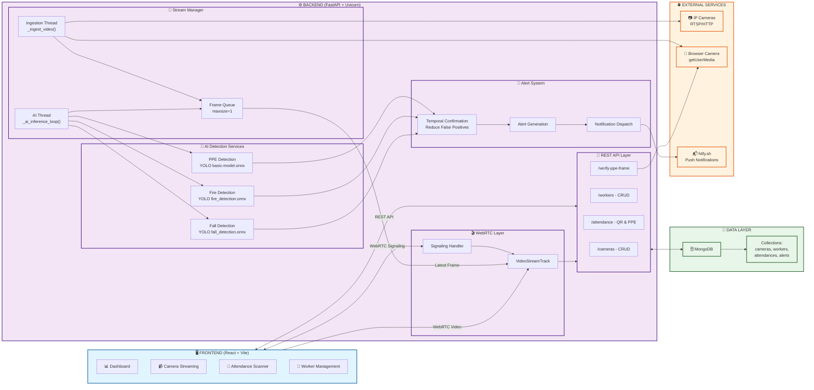
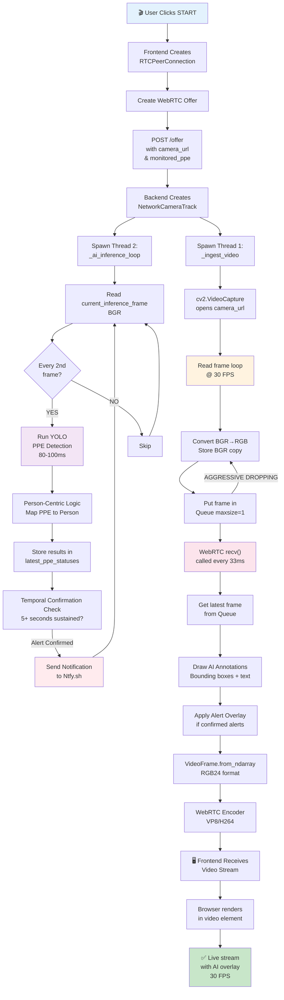
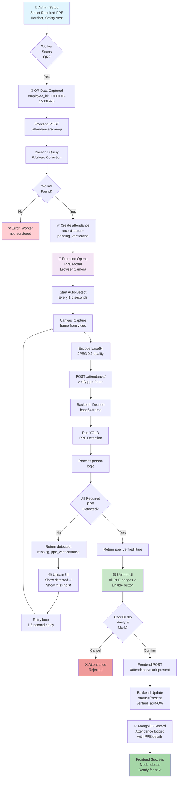
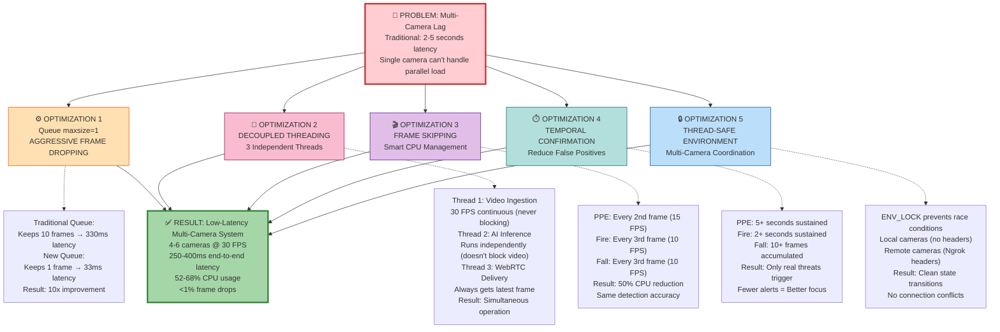
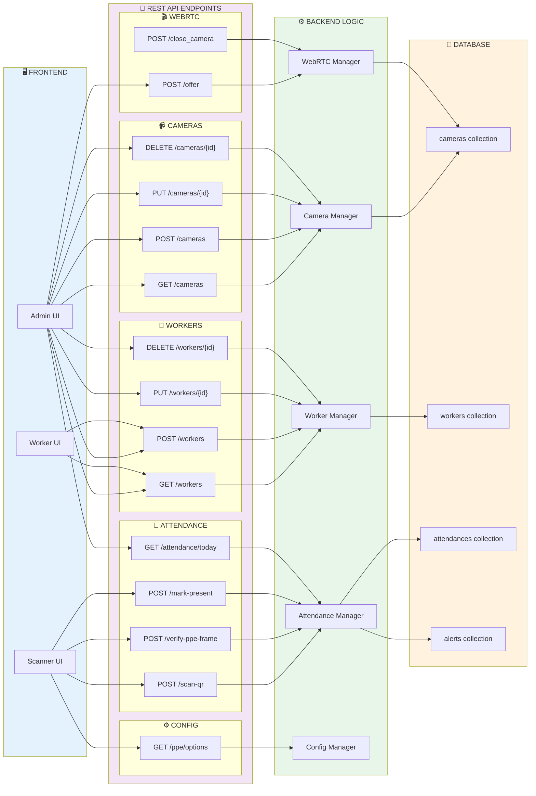
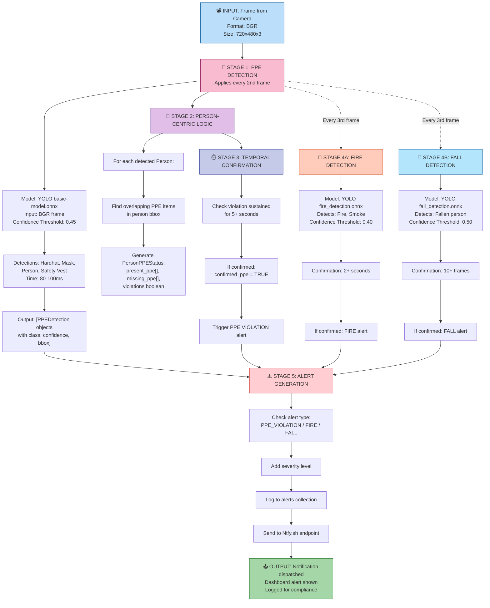
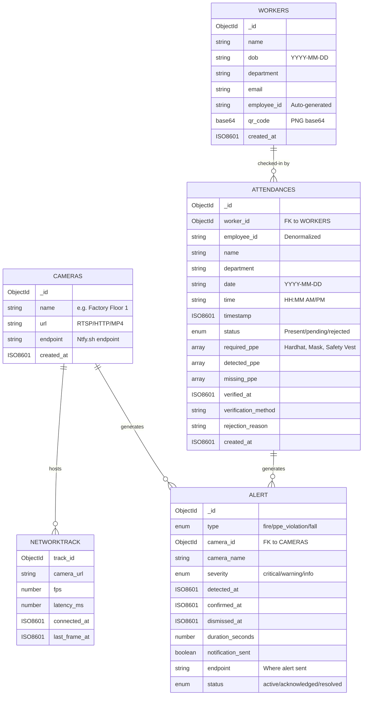

# Ready-to-Use Mermaid Diagrams for Smart Safety CCTV System

Copy and paste any diagram code into your documentation or use with `renderMermaidDiagram` tool.

---

## 1️⃣ SYSTEM ARCHITECTURE DIAGRAM

**Description**: Complete high-level system architecture showing all layers and components.



---

## 2️⃣ DATA FLOW DIAGRAM (Streaming + Detection)

**Description**: Real-time streaming data flow with parallel thread execution.



---

## 3️⃣ ATTENDANCE + PPE VERIFICATION FLOW

**Description**: Complete workflow from QR scan to attendance marked.



---

## 4️⃣ MULTI-CAMERA LAG OPTIMIZATION LAYERS

**Description**: How the system solves multi-camera latency issues.



---

## 5️⃣ API ENDPOINT INTERACTION DIAGRAM

**Description**: All REST endpoints and their interactions.



---

## 6️⃣ AI DETECTION PIPELINE

**Description**: Sequential stages of AI model inference.



---

## 7️⃣ DATABASE RELATIONSHIPS

**Description**: MongoDB collections and their relationships.



---

## 8️⃣ COMPLETE ORCHESTRATION SEQUENCE

**Description**: Swimlane sequence showing all actors and interactions.

```mermaid
sequenceDiagram
    actor Admin
    participant Frontend
    participant Backend
    participant AIThread as AI Thread
    participant MongoDB
    participant Camera
    participant Ntfy as Ntfy.sh

    Note over Admin,Ntfy: SCENARIO 1: SETTING UP A CAMERA
    Admin->>Frontend: Opens dashboard
    Admin->>Frontend: Clicks "Add Camera"
    Frontend->>Backend: POST /cameras<br/>{name, url, endpoint}
    Backend->>MongoDB: Insert camera document
    MongoDB-->>Backend: {_id: "...", name: "..."}
    Backend-->>Frontend: Success response
    Frontend->>Admin: Show camera added

    Note over Admin,Ntfy: SCENARIO 2: STARTING A LIVE STREAM
    Admin->>Frontend: Clicks "Start" on camera
    Frontend->>Frontend: Create RTCPeerConnection
    Frontend->>Backend: POST /offer<br/>{sdp, camera_url, monitored_ppe}
    Backend->>Backend: Create NetworkCameraTrack
    Backend->>AIThread: Spawn ingest + AI threads
    AIThread->>Camera: Open stream connection
    Backend->>Frontend: Send Answer (SDP)
    Frontend->>Frontend: WebRTC established
    AIThread->>Camera: Read frame loop (30 FPS)
    AIThread->>AIThread: Store frame, put in Queue
    AIThread->>AIThread: Run YOLO detection
    Backend->>Frontend: Send video frame via WebRTC (every 33ms)
    Frontend->>Admin: Render live video

    Note over Admin,Ntfy: SCENARIO 3: PPE VIOLATION ALERT
    AIThread->>AIThread: Detect PPE violation<br/>(5+ seconds)
    AIThread->>AIThread: confirmed_ppe = TRUE
    Backend->>Ntfy: POST notification<br/>"PPE VIOLATION DETECTED"
    Ntfy-->>Admin: Push notification
    Backend->>MongoDB: Insert alert record
    Frontend->>Admin: Show alert overlay on video
    Admin->>Frontend: Dismiss alert

    Note over Admin,Ntfy: SCENARIO 4: ATTENDANCE CHECK-IN
    actor Worker
    Worker->>Frontend: Scan QR code
    Frontend->>Backend: POST /attendance/scan-qr<br/>{qr_data, required_ppe}
    Backend->>MongoDB: Create attendance record<br/>status=pending_verification
    Backend-->>Frontend: {recordId, requiredPPE, ...}
    Frontend->>Worker: Open PPE modal
    Worker->>Worker: Position camera
    loop Every 1.5 seconds
        Frontend->>Frontend: Capture frame from video
        Frontend->>Backend: POST /verify-ppe-frame<br/>{frame_base64, required_ppe}
        Backend->>AIThread: Decode frame, run detection
        AIThread-->>Backend: {detected_ppe, ppe_verified}
        Backend-->>Frontend: Detection results
        Frontend->>Frontend: Update UI badges
    end
    Frontend->>Frontend: All PPE detected
    Worker->>Frontend: Click "Verify & Mark Present"
    Frontend->>Backend: POST /mark-present<br/>{record_id}
    Backend->>MongoDB: Update attendance<br/>status=Present, verified_at=NOW
    Backend-->>Frontend: Success
    Frontend->>Worker: Show success message

    style Admin fill:#e3f2fd
    style Frontend fill:#f3e5f5
    style Backend fill:#e8f5e9
    style AIThread fill:#fff3e0
    style MongoDB fill:#fce4ec
    style Camera fill:#ffebee
    style Ntfy fill:#c8e6c9
```

---

## 🎯 USAGE INSTRUCTIONS

### **Render These Diagrams:**

**Option 1: Python (in your project)**

```python
from renderMermaidDiagram import renderMermaidDiagram

renderMermaidDiagram("""
graph TD
    A[Component] --> B[Other Component]
""", title="My Diagram")
```

**Option 2: Online**

- Visit https://mermaid.live
- Paste any diagram code
- Customize and export

**Option 3: GitHub**

- Add to README.md in code block with ` ```mermaid `
- GitHub auto-renders

**Option 4: Documentation**

- Copy into your docs
- Most markdown renderers support Mermaid

---

## 📝 CUSTOMIZATION TIPS

- **Change colors**: Modify `fill:#e3f2fd` to your brand colors
- **Add details**: Insert more nodes/connections as needed
- **Resize text**: Use `<br/>` for line breaks in nodes
- **Add icons**: Use Unicode symbols (🎬, 📹, 🤖, etc.)
- **Change layout**: Use `graph TD` (top-down), `graph LR` (left-right), or `flowchart`
