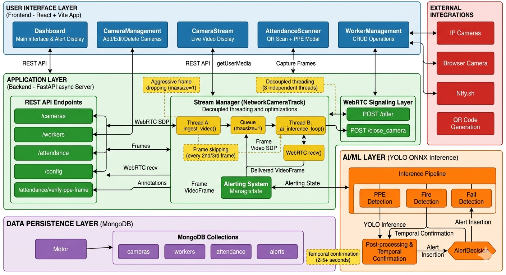

# Smart Safety & CCTV Monitoring — Consolidated Overview

This document consolidates the project documentation into a single, professional README that describes the problem we solve, the approach, AI models used, multi-camera handling, and a concise system overview.

## Defined problem statement

Industrial sites require continuous, real-time monitoring to detect personal protective equipment (PPE) violations, fire, and falls across multiple camera feeds. Existing approaches either introduce multi-second latency when scaling to multiple cameras or produce frequent false alerts, reducing operator trust. The goal is a low-latency, reliable monitoring system that scales to multiple cameras while providing attendance verification tied to PPE checks.

## Our approach

## Project structure

The repository is laid out to separate frontend, backend, models and helper scripts:

```
DT-PROJECT/
├── backend/            # FastAPI application (API, WebRTC, AI services)
│   ├── models/         # Detection service implementations
│   ├── main.py         # FastAPI entry point
│   └── requirements.txt
├── frontend/           # React + Vite dashboard
│   ├── src/            # React components and assets
│   └── package.json
├── models/             # ONNX model files (basic-model.onnx, fire_detection.onnx, fall_detection.onnx)
├── scripts/            # Utility scripts (model analysis, tests)
├── videos/             # Sample or test videos
└── README.md           # This consolidated overview
```

## Tech stack

- Backend: FastAPI (async web server), aiortc (WebRTC integration), OpenCV (frame handling), ONNX Runtime (model inference).
- Frontend: React + Vite — lightweight, fast UI for dashboards, camera cards, and attendance flows.
- Data: MongoDB (async Motor driver) for cameras, workers, attendance, and alerts.
- Models: YOLO-based ONNX models for PPE, fire, and fall detection.
- Notifications: Ntfy.sh for simple push notification dispatch.

## Dependencies used

Backend (Python): listed in `backend/requirements.txt` — install with `pip install -r backend/requirements.txt`.

- fastapi
- uvicorn
- aiortc
- opencv-python
- numpy
- ultralytics
- onnx
- onnxruntime-gpu
- motor
- python-dotenv
- qrcode

Frontend (Node): listed in `frontend/package.json` — install with `npm install` inside `frontend/`.

- react
- react-dom
- jsqr
- vite (dev)
- eslint and related dev dependencies

## Architecture diagram

The diagram below shows the system layers and key components (frontend, backend stream manager, AI/ML layer, persistence, and external integrations). Place the provided image at `Architecture.png` to render it here.



_Figure: System architecture — ingestion, AI inference, WebRTC delivery, and alerting._

## Notes

- Performance and scaling:
  - Each camera runs isolated ingestion and AI threads so a slow camera or model won't stall others.
  - The `maxsize=1` frame queue eliminates backlog; WebRTC always serves the latest frame.
  - Frame-skipping keeps CPU usage manageable while preserving detection reliability.

- Alerting and correctness:
  - Temporal confirmation windows reduce false positives (PPE: ~5s, Fire: ~2s, Fall: multi-frame).
  - Alerts are rate-limited and stored in the `alerts` collection to avoid spamming operators.

- Attendance verification:
  - QR scan creates a pending attendance entry; browser-camera frames are verified via the PPE model before marking present.
  - Verification retries every ~1.5s until success or manual rejection.

## Models used and responsibilities

- `basic-model.onnx` (YOLO) — PPE detection: Hardhat, Mask, Person, Safety Vest. Primary model for person-centric PPE mapping and verification.
- `fire_detection.onnx` (YOLO) — Fire / smoke detection. Used with a 2+ second confirmation window before alerting.
- `fall_detection.onnx` (YOLO) — Fall detection (person/pose-based). Uses multi-frame accumulation before confirmation.

Each model runs in the AI inference thread (separate from ingestion and WebRTC). Detection rates are tuned to balance CPU load and timeliness (typical inference: 60–120 ms on CPU; processed at reduced rates via frame skipping).

## How multiple cameras are handled

- Per-camera `NetworkCameraTrack` instances: each camera has its own ingestion and AI threads so processing and IO are isolated.
- Frame queue with `maxsize=1`: when a new frame arrives and the queue is full, the old frame is immediately dropped and replaced by the newest frame. This prevents queue accumulation and ensures low, bounded latency.
- Decoupled AI inference: AI threads read the latest stored frame independently and run detections at a reduced cadence (frame skipping) so heavy inference does not block ingestion or delivery.
- Temporal confirmation: alerts are raised only after sustained detections (e.g., PPE violations persist for 5+ seconds, fire for 2+ seconds, fall accumulated across several frames), reducing false positives when scaling across cameras.
- The WebRTC layer serves each camera as a distinct `VideoStreamTrack`, allowing the frontend to open multiple simultaneous streams while backend resources are managed per-camera.

## System overview

- Backend: FastAPI + aiortc. Handles REST endpoints (camera/workers/attendance), WebRTC signaling (`/offer`), stream manager, and AI services.
- Frontend: React + Vite. Admin dashboard, camera cards (start/stop), QR attendance scanner, and PPE verification modal.
- Data: MongoDB storing `cameras`, `workers`, `attendances`, and `alerts` collections.
- Notifications: rate-limited push notifications via Ntfy.sh for confirmed alerts.
- Optimization highlights: per-camera queue=1, decoupled threads, frame skipping, and temporal confirmation — enabling 4–6 cameras at near real-time latency (typical end-to-end 250–400 ms under expected hardware).


## Quick developer notes

- Key API endpoints: `GET/POST /cameras`, `POST /offer` (WebRTC), `POST /attendance/scan-qr`, `POST /attendance/verify-ppe-frame`, `POST /attendance/mark-present`.
- Models are stored in `/models/` and referenced by the AI services in `backend/models/`.
- To run locally: start the backend (`uvicorn main:app --reload`) and the frontend (`npm run dev`) after installing dependencies.

---
